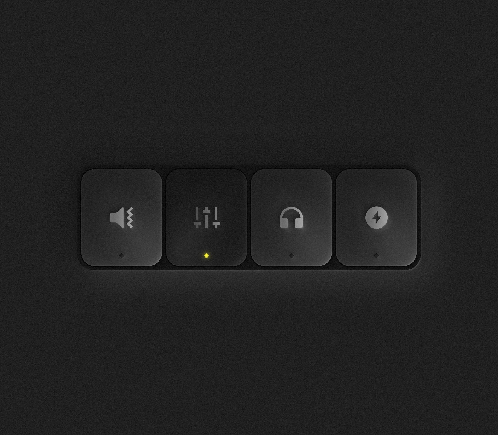

# Neumorphic Button

A fun neumorphic-style button inspired by a design on X.  
Built with **React** and **CSS**.  

## Demo 
👉 [Play with the button](https://unnecessary-special-projects.github.io/neumorphic-button)  

## Inspiration

Original design shared on X:  
👉 [View the post](https://x.com/speytdesign/status/1969147550134345736)  

## Credits

* Designed by [Oleg Kulik](https://x.com/speytdesign)
* Developed by [Unnecessary & Special Projects](https://x.com/uandsp)
* Sound effect by [freesound_community](https://pixabay.com/users/freesound_community-46691455/?utm_source=link-attribution&utm_medium=referral&utm_campaign=music&utm_content=104585)
